# Super Mario Land — Watara Supervision port

A from-scratch reverse-engineering and 1:1 port of the Game Boy game
**Super Mario Land** (1989) to the **Watara Supervision**, a contemporary
8-bit (WDC 65C02) handheld. Every level, enemy, animation, sound and quirk is
reproduced by reverse-engineering the original and re-implementing it on the
Supervision's very different CPU and video hardware.

Runs on real Watara Supervision hardware (via a flash cart) and in emulators
(Potator, incl. the RetroArch Potator core).

<p align="center">
  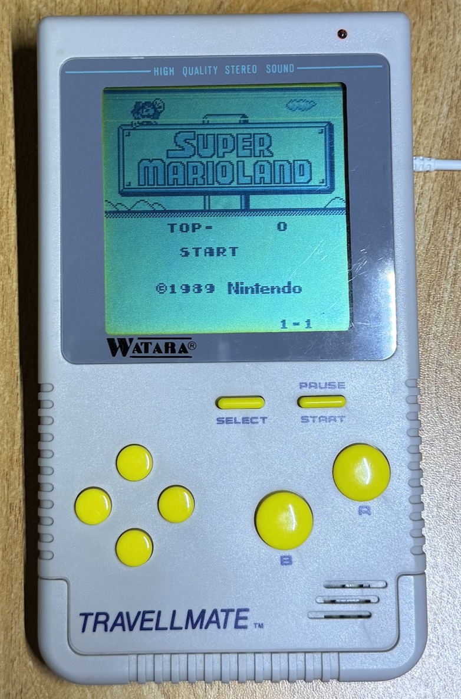
  <br><em>The port running on real Watara Supervision hardware.</em>
</p>

> **This repository contains no game ROM data.** All graphics, level maps,
> tables, music and sound effects are **extracted from your own legally-owned
> Game Boy Super Mario Land ROM at build time**. You must supply that ROM
> yourself — see [Building](#building). Nothing ROM-derived is committed here.

## Status

All 12 levels are complete and playable, including enemies, bosses, the bonus
games, block power-ups, the underwater (Marine Pop) and sky (Sky Pop) vehicle
levels, the full 7-track music engine + sound effects, and the animated ending
with credits and music. See [`PROGRESS.md`](PROGRESS.md) for the detailed log
and [`docs/`](docs/) for the per-subsystem reverse-engineering notes.

The boot sequence opens with an original pre-title splash — the porter's tag
"ELEFAS" rising to a small chime, in the spirit of the Supervision/Travellmate
boot logo (see `docs/48`) — then the faithful SML title.

One known cosmetic gap is documented: the 4-3 pipe fists draw in front of their
pipe instead of behind it (a renderer limitation; see `docs/45`).

## Screenshots

All captured from the port (emulated Watara Supervision):

| Title | World 1-1 | World 1-2 | World 1-3 |
|:---:|:---:|:---:|:---:|
| 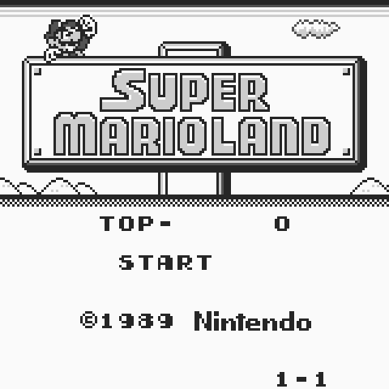 | 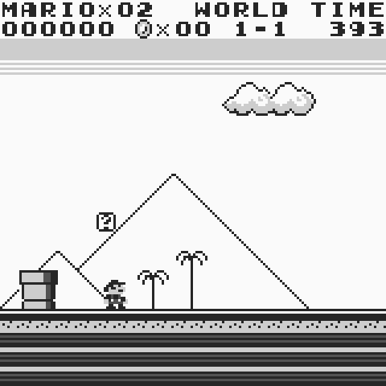 | 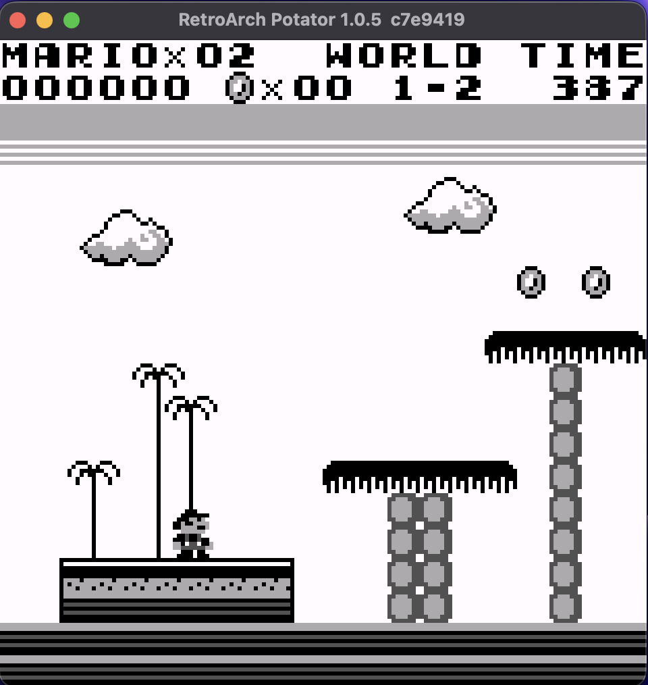 | 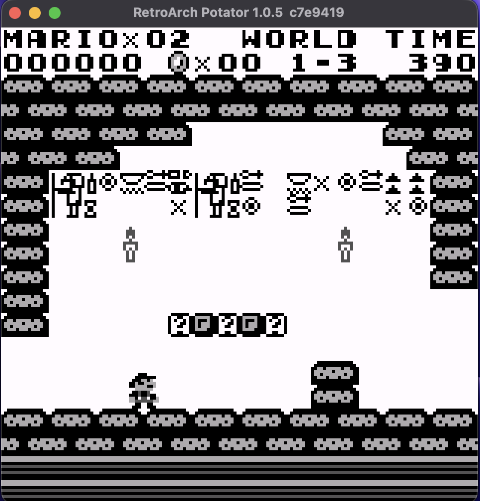 |
| **World 2-1** | **World 2-2** | **World 2-3** (Marine Pop) | **World 3-1** |
| 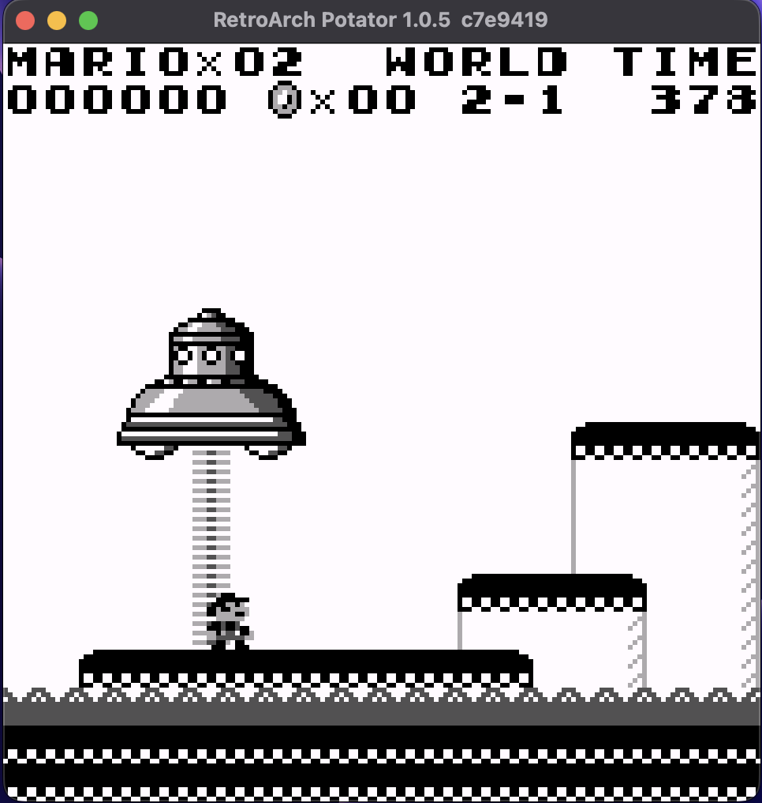 | 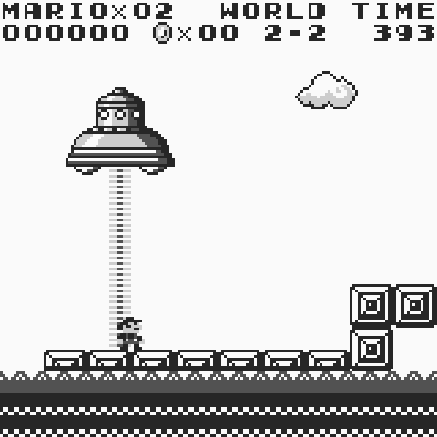 | 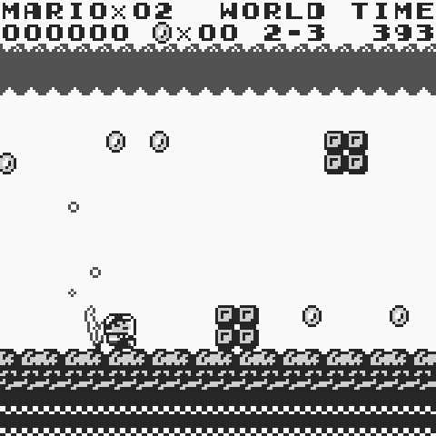 | 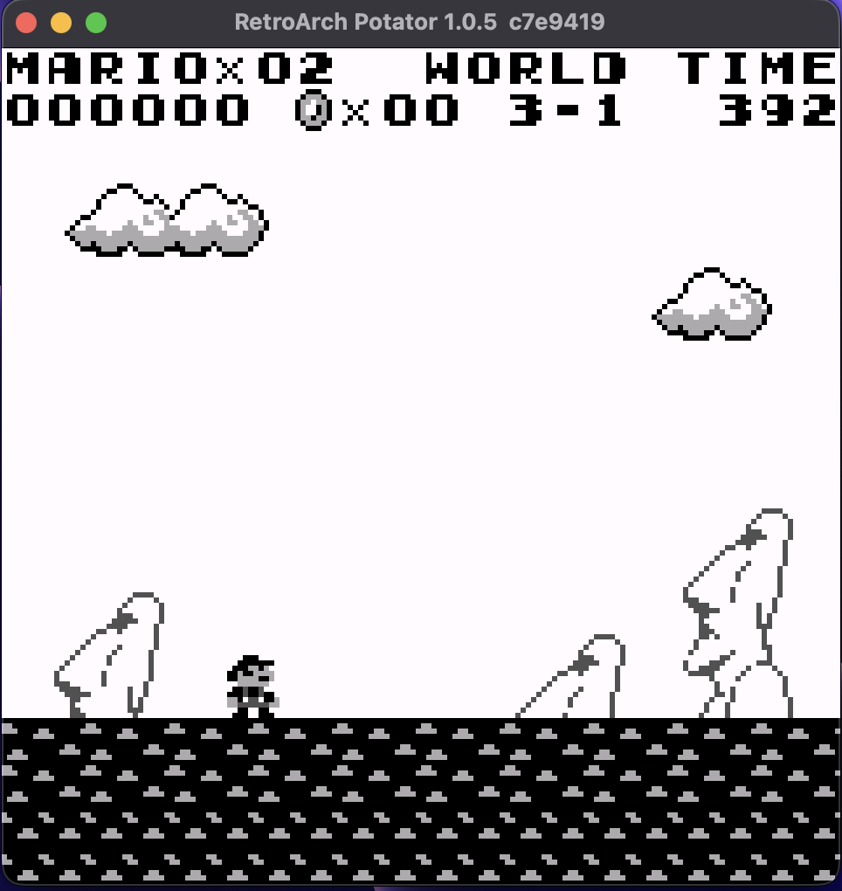 |
| **World 3-2** | **World 3-3** | **World 4-1** | **World 4-2** |
| 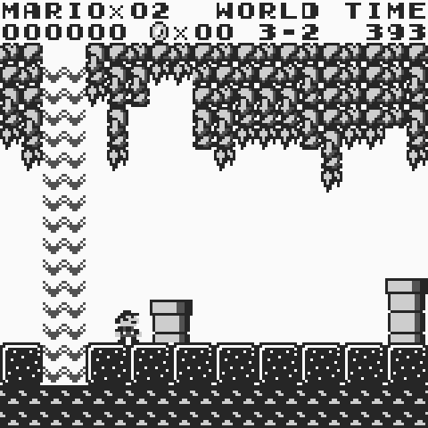 | 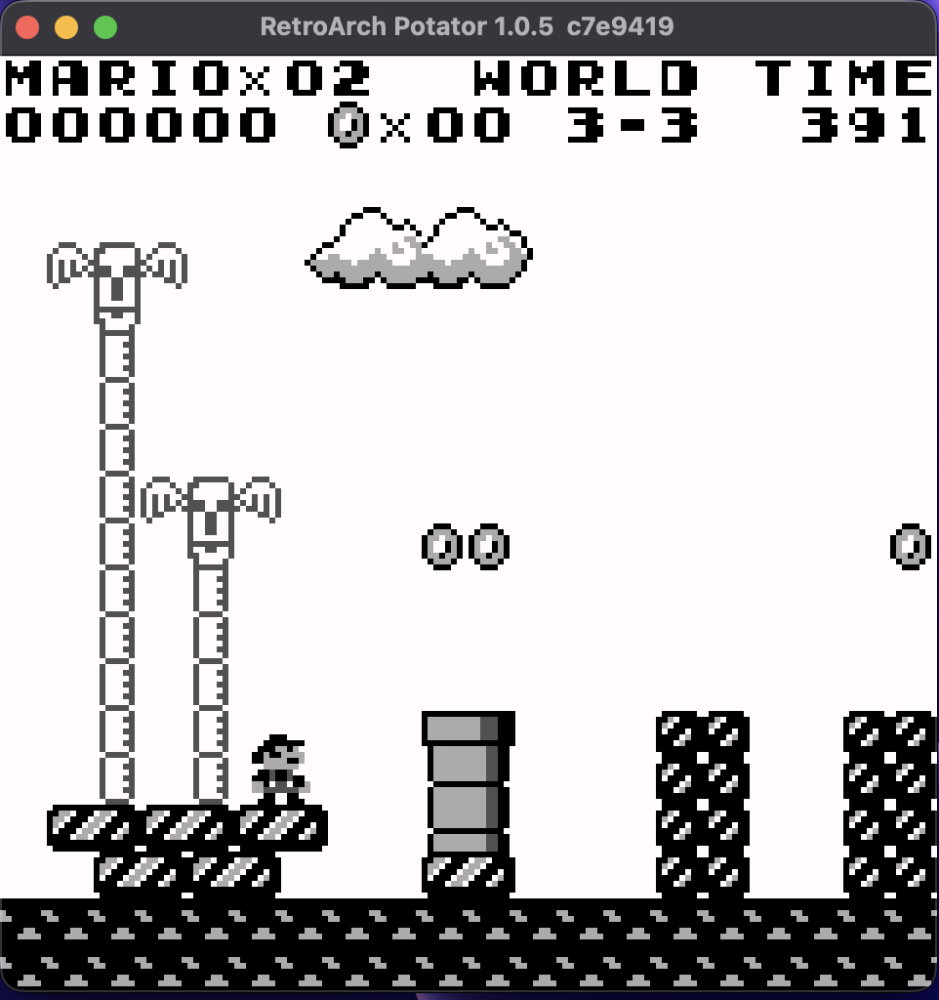 | 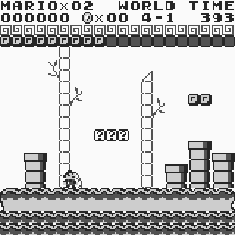 | 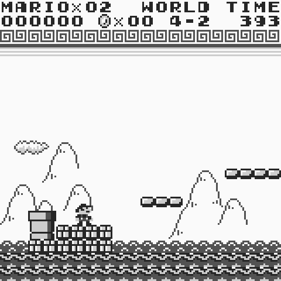 |
| **World 4-3** (Sky Pop) | | | |
| 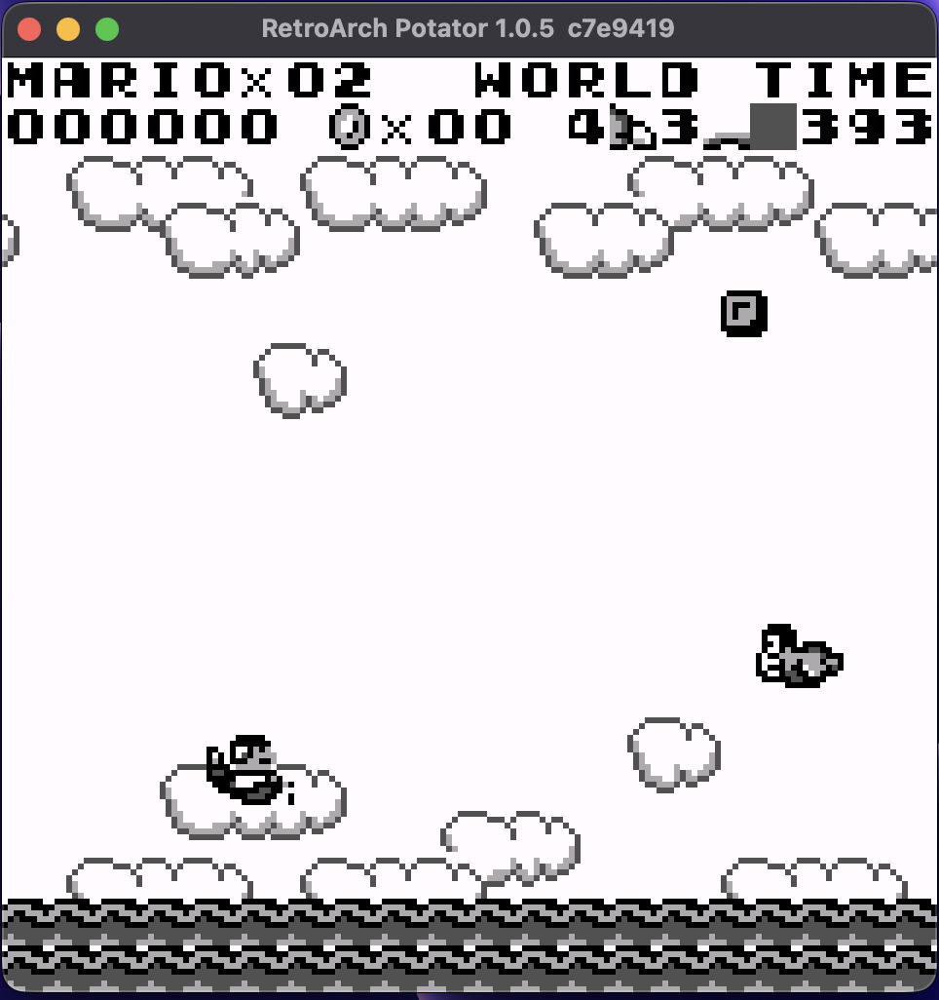 | | | |

## Building

You need your own Super Mario Land (World) Game Boy ROM. Place it in the repo
root as:

```
super-mario-land-gb.gb        # SHA1 418203621b887caa090215d97e3f509b79affd3e
```

Then run the build script — it installs the toolchain (cc65 + Python `pypng`)
if it's missing, then extracts the assets from your ROM and builds:

```sh
./build.sh
```

Output (gitignored): `build/super-mario-land.sv`. Load it in a Watara
Supervision emulator such as [Potator](https://github.com/Xer0X/Potator) or the
RetroArch Potator core.

Options:

```sh
./build.sh --smooth  # also build build/super-mario-land-smooth.sv (the
                     # "gameplay-accurate" smooth flavor — see below)
./build.sh --god     # also build build/super-mario-land-god.sv (invincible, for
                     # watching a whole level/ending without dying)
./build.sh --deps    # only install/verify the toolchain
```

If you prefer to drive it yourself, the build is a plain `Makefile`
(`make`, `make smooth`, `make godmode`); its only requirements are `ca65`/`ld65`
(cc65), `python3`, and the `pypng` module.

### Two flavors

The port builds in two flavors from the same source (all differences are
`.ifdef SMOOTH`-guarded, so the default build is unaffected):

| | Default — `make` | Smooth — `make smooth` |
|---|---|---|
| Output | `build/super-mario-land.sv` | `build/super-mario-land-smooth.sv` |
| Goal | **near-100% original-accurate** | **near-100% gameplay-accurate** |
| HUD | fixed status bar at the top, always visible (as on the Game Boy), via a mid-frame raster split | hidden during play, shown **on pause**; top and bottom 16-row strips are blanked |
| Trade-off | 1:1 with the original, but the raster split costs CPU every frame and can wobble a few pixels on real hardware | no split → whole-screen smooth scroll, the freed budget cuts flicker/slowdown (~40% fewer dropped-frame sprite blanks in crowded scenes), at the cost of the always-on HUD |

The default flavor is the faithful reference; the smooth flavor is for players
who prefer maximum smoothness and don't mind the HUD moving to the pause screen.
See [`docs/`](docs/) for the raster-split and rendering notes.

### Toolchain

| Tool | Purpose | Install |
|------|---------|---------|
| **cc65** (`ca65`, `ld65`) | 65C02 assembler + linker | `brew install cc65` / `apt install cc65` / built from source by `build.sh` |
| **Python 3** + `pypng` | asset extraction from your ROM | `pip install pypng` |
| **rgbds** (optional) | rebuild the byte-identical GB disassembly (`tools/regen.sh`) | `brew install rgbds` |
| **cc/gcc + Potator** (optional) | the pixel-diff verification harness (`svshot`, `svgold`, `battery31`) | — |

## How it's verified

The port is held to a strict rule: **reverse-engineering proposes, a capture
verifies.** Behaviour is measured on the original (Game Boy, via PyBoy traces)
and on the port (the real Potator core), and compared frame-by-frame. Two
regression gates guard every change:

- `tools/svgold.sh` — hashes sampled framebuffers across levels; any unintended
  change shows as a diff.
- `tools/battery31.py` — asserts specific mechanics (stomps, rides, boss chains,
  scoring) on the real core.

The `tools/` directory holds this whole toolkit: GB tracers (`gb*.py`,
`trace_*.lua`), the port harness (`sv*`), the asset extractors (`extract_*.py`),
and the bank packers (`pack_*.py`). See [`docs/05-methodology.md`](docs/05-methodology.md).

## Repository layout

```
src/        the 65C02 port source (main.s + per-world kit_*.inc)
cfg/        ld65 linker configs (memory maps / bank layout)
tools/      asset extractors, bank packers, and the RE/verification toolkit
docs/       reverse-engineering notes and port design, per subsystem
hwtest/     small standalone Supervision hardware test ROMs
symbols/    hand-authored RE labels for the GB disassembly (no ROM bytes)
```

## Legal

This project is an original re-implementation for the Watara Supervision. It
distributes **no copyrighted material**: no Game Boy ROM, no extracted
graphics/levels/audio, no save data. Super Mario Land is © Nintendo. You must
own a legal copy of the original to build this, and the result is for personal
use with your own ROM.
